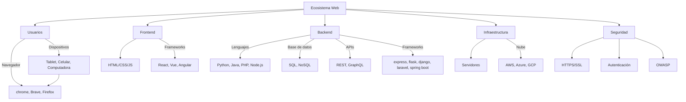

```mermaid
   
graph TD
    A[Ecosistema Web] --> B[Usuarios]
    A --> C[Frontend]
    A --> D[Backend]
    A --> E[Infraestructura]
    A --> F[Seguridad]

    B --Navegador--> B1[chrome, Brave, Firefox]
    B --Dispositivos--> B2[Tablet, Celular, Computadora]
    B2 --> B1

    C --> C1[HTML/CSS/JS]
    C --Frameworks--> C2[React, Vue, Angular]

    D --Lenguajes--> D1[Python, Java, PHP, Node.js]
    D --Base de datos--> D2[SQL, NoSQL]
    D --APIs--> D3[REST, GraphQL]
    D --Frameworks--> D4[express, flask, django, laravel, spring boot]

    E --> E1[Servidores]
    E --Nube--> E2[AWS, Azure, GCP]

    F --> F1[HTTPS/SSL]
    F --> F2[Autenticación]
    F --> F3[OWASP]
    
```
